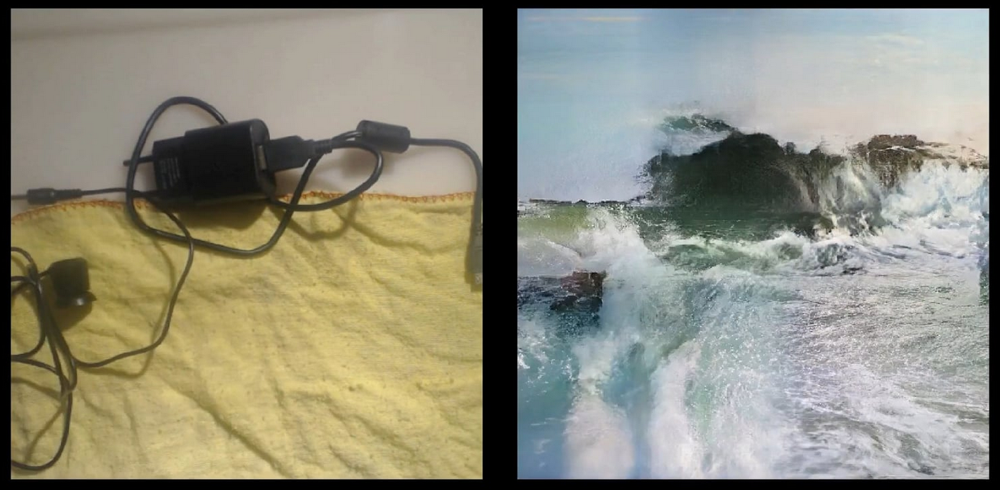
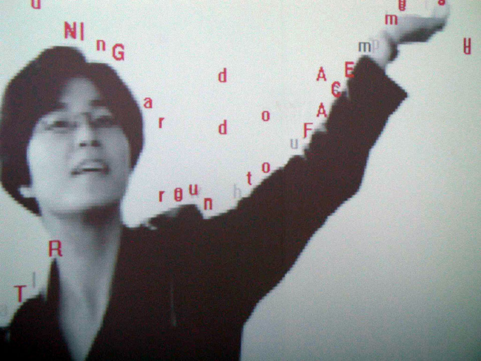

# Week 01 - 02/02/21

## Agenda

### Morning (9:30-12:30p)

[ Watch Lecture 1-1](https://www.youtube.com/watch?v=jv_p-k5fays)

#### 1. Join Slack
  1. [Invite Link (only do this if you haven't already joined the workspace)](https://join.slack.com/t/cvmlsaic-sp21/shared_invite/zt-kzu1o4vp-Zry5GBpQWjBa9IBKDjZ04Q)
  2. [Link to the CVML Slack Workspace](http://cvmlsaic-sp21.slack.com/)
  3. (Recommended) Download the Desktop Slack App. You can use Slack in your browser if you'd prefer.
   
#### 2. Introductions
  1. Fill out [Day 1 Survey](https://docs.google.com/forms/d/e/1FAIpQLSddOpEisL2auL8DuDzz_cYTnOvEwEUA5jdNgMLJ8OYXCYcOEg/viewform?usp=sf_link)
  2. In Zoom, set your Display name to include your preferred name, and your pronouns
  3. Make sure you receive Canvas announcement notifications to your email
  4. Meet everybody!
  5. Go over Syllabus

#### 3. Computer Vision: a brief introduction
1. "Traditional" vs. Machine Learning-based Computer Vision
   1. "Traditional": writing specific algorithms "by hand" that allow a computer to parse images (like brightness thresholding, detecting edges, finding contours). Takes enormous amount of work to write effective algorithms. (For example, programming a computer to identify a dog by **describing in code** what makes a dog a dog)
   
   *Canny Edge Detection ([Wikipedia, Edge detection](https://en.wikipedia.org/wiki/Edge_detection))*
   1. Machine Learning: feeding vast amounts of data into an artificial neural network that then "learns" its own way of describing an image. Often talked about as a form of Artificial Intelligence. (For example, teaching a computer to identify a dog by **feeding it 10,000 images of dogs**, then allowing it to come up with its own description of what a dog is)
   
   *Convolutional Neural Network with displaying salient features of this image ([ml4a, Convnet Viewer](https://ml4a.github.io/guides/ConvnetViewer/))*
   1. Both techniques are still widely used, as they're both useful for different tasks. They're frequently used together, where traditional CV approaches are used to prepare images for a data set that is then fed to a neural network.

#### 4. Art Examples

*Learning to see: Gloomy Sunday - Memo Akten, 2017 [[watch on vimeo]](https://vimeo.com/260612034)*

*ImageNet Roulette - Kate Crawford, Trevor Paglen, 2019 [[article]](https://www.frieze.com/article/how-ai-selfie-app-imagenet-roulette-took-internet-storm) [[essay]](https://excavating.ai/)*

*Text Rain - Camille Utterback, Romy Achituv, 2000 [[view work]](http://camilleutterback.com/projects/text-rain/)*

#### 5. AI Examples

* [AttnGAN](https://experiments.runwayml.com/generative_engine/) - Text-to-image neural network model (2017)
* [The Big Sleep](https://dank.xyz/) - Text-to-image (2020)
* [DALL·E](https://openai.com/blog/dall-e/) - OpenAI's State-of-the-Art Text to image model (2020) (Avocado chairs!!)
* [edges2cats](https://affinelayer.com/pixsrv/) - pix2pix Image-to-Image Demo
* [thispersondoesnotexist.com](https://thispersondoesnotexist.com/) - photorealistic faces of "people that don't exist" generated by Nvidia's StyleGAN2
* [thiscatdoesnotexist.com](https://thiscatdoesnotexist.com/) - same as above, but with cats

#### 6. Tool Setup

1. **GitHub**
   1. Create a [GitHub](https://github.com/) account (if you don't already have one)
      1. make your username something easy to remember
      2. 

### Afternoon (2:00p-5:00p)
[ Watch Lecture 1-2](https://www.youtube.com/watch?v=tw-3QEblSGI)

* [The Big Sleep (Text to Image)](https://dank.xyz/)
* [DALL·E](https://openai.com/blog/dall-e/)